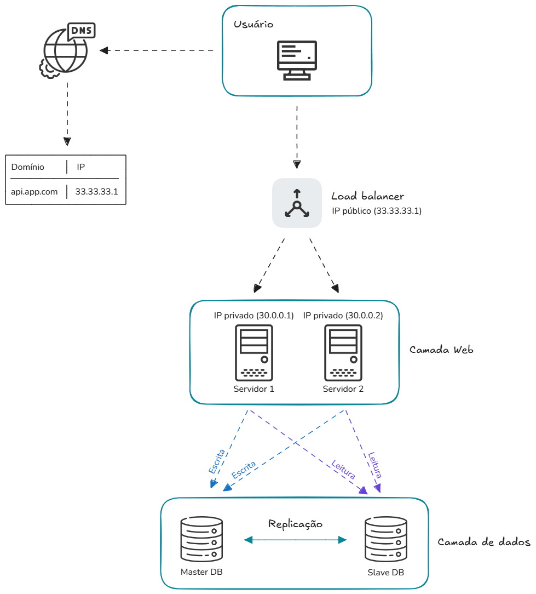

# Challenge Frontend Developer - RPE

## 1. Arquitetura de Front-end:

*Você precisa definir a arquitetura de uma nova aplicação web que será 
utilizada por milhões de usuários do varejo. Descreva a stack de 
tecnologias que você escolheria (frameworks, bibliotecas, ferramentas) e 
justifique suas escolhas. Como você garantiria que a arquitetura seja 
flexível e escalável para futuras expansões, e aplicável a novas 
aplicações?*

Um framework para uma aplicação robusta, com certeza eu faria o uso do Next.js.\
**Pensando no lado dos usuários** que acessariam a aplicação, eles se beneficiariam com a performance que o próprio framework fornece. Com estratégias e recursos bem implementados de SSR(Server Side Renderigin), SSG(Static Site Generation) e otimizações de imagens, a aplicação teria carregamentos mais rápidos, uma melhor fluídez durante seu uso, garantindo assim uma excelente experiência independente do grande volume de acesso. Esta ideia de stack para o desenvolvimento proposto se paga quando temos um grande exemplo de showcase, no caso o e-commerce da nike(https://www.nike.com/), muito conhecido e acessado em grande escala.

**E no ponto de vista dos desenvolvedores,** o Next.js é uma excelente opção devido a variedades de recursos disponíveis para o desenvolvimento. Posso citar alguns deles.
- Todos recursos do ecossistema React;
- Suporte ao Typescript: Uma stack que nos ajuda na escrita e leitura do código. Iríamos evitar e "desviar" de bugs durante o desenvolvimento, e também teriámos fácil compreensão das coisas dentro do código, cada função e seus retornos, tipos de variáveis, etc;
- Fácil integração com banco de dados SQL utilizando ORM(prisma);
- Fácil integração com sistemas de autenticação através de grandes bibliotecas como NextAuth.js e Clerk;
- Controle de renderização de páginas com SSR e SSG;
- Roteamento com base em arquivos, tornando ainda mais prático esta funcionalidade que é crucial e sem precisar instalar bibliotecas externas;
- Suporte de uma comunidade de desenvolvedores bem ampla em caso dos devs enfrentarem problemas durante o desenvolvimento;
- Na parte de componentização é possível utilizar um design pattern cujo nome é "Compound Pattern", que tem por objetivo de construir componentes de fácil manutenção com alta legibilidade. Até mesmo uma grande e conhecida biblioteca de UI Kit "Chakra UI" se beneficia deste pattern.

Este framework moderno por si só já é preparado para construções de aplicações web escaláveis e flexíveis pelo o que ele tem à oferecer. Implementando todas as funcionalidades essenciais da melhor forma, se guiando pela vasta documentação e todos da equipe estando na mesma "página", conseguiríamos deixar um projeto fácil para dar manutenções, além de acrescentar novas funcionalidades quando precisasse.

Em minha concepção, estas seriam as tecnologias primordias para se trabalhar no projeto:
- Construção do layout:	Tailwind e shadcn/ui para agilizar na construção da interface, aproveitar componentes prontos, além de criar o nosso próprio desing system;
- Gerenciamento de estado global:	Zustand
- Gerenciamento e validação de formulários:	React Hook Form
- Autenticação:	NextAuth.js (JWT e logins em redes sociais)
- Backend/API: Next.js API Routes
- Banco de dados: PostgreSQL (com prisma ORM)
- Armazenamento de imagens e assets: AWS S3
- Monitoramento: Sentry + Vercel Analytics

**Agora indo mais para o lado de infraestrutura**, apresento a seguinte ideia de arquitetura para que esta aplicação fosse capaz de suportar o acesso de milhões de usuários.\
Basicamente estaríamos resolvendo o problema de acesso de enorme volume utilizando uma arquitetura de escalabilidade horizontal, com load balancer gerenciando o tráfego para as réplicas dos servidores de APIs, e esses servidores acessariam a camada de banco de dados sobre a implementação da estratégia de "database replication", que consiste garantir redundância e sempre termos os dados do banco disponíveis. Segue o detalhamento breve do fluxo desta arquitetura:
1. Por meio do navegador web o usuário faz a requisição para o domínio. O DNS resolve para o IP público do nosso load balancer configurado, pois ele que vai estar à frente dos nossos servidores de APIs;
2. O load balancer estará prontamente preparado para lidar com grande volumes de requisições, distribuindo a carga de forma equilibrada entre os servidores  evitando sobrecarga e ainda garantindo alta disponibildade com a essa estratégia de réplica das instâncias, pois em caso de falha de um servidor, temos o outro;
3. Os servidores executam a lógica da aplicação, realizando operações de escrita no banco de dados principal (Master DB) e leitura no banco de dados secundário (Slave DB). Os dados são sincronizados por meio de replicação entre os bancos, garantindo consistência e desempenho otimizado ao separar as operações de leitura e escrita.

**Diagrama:**

 

## 2. Manutenção e evolução de projetos:

*Você foi designado para melhorar uma aplicação existente que possui um 
código legado com alta dívida técnica. Qual seria seu plano de ação para 
refatorar o código e reduzir a dívida técnica? Detalhe os passos que você 
seguiria para garantir a qualidade e continuidade da aplicação durante esse 
processo.*

Todas as vezes em que tive a oportunidade de trabalhar com código legado, foi o suficiente para desejar construir tudo do zero. É sempre a alternativa mais rápida e menos dolorosa, mas isso é algo que tem que ser bem avaliado. Hoje em dia eu analiso bem o quadro, os problemas contidos e o que eu vou poder realizar a seguir. Dependendo da situação, eu pensaria num plano de reconstrução, com certeza. Mas não apenas por ser mais fácil, mas sim para ter um projeto o mais atualizado o possível. O risco de ter um projeto obsoleto são muitos, ainda mais se tratando de brechas de segurança, por exemplo. 

Vou detalhar as medidas que tomaria até conseguir chegar em um projeto atualizado e menos problemático.
1. Estudaria bastante os arquivos desse projeto. Primeiramente tenho que entender bem o que ocorre, o que o código faz e como faz. Analisaria a estrutura de diretórios e tentaria identificar se segue ou não algum tipo de arquitetura, ou qualquer informação que sirva como um norte para eu poder prosseguir, isso também inclui buscar informações com funcionários/equipe ou revisão da documentação das funcionalidades, pois preciso ter bem definido na minha mente as regras de negócio do sistema.
2. Após eu ter um bom conhecimento do que se passa em um determinado módulo/funcionalidade(realizaria essas ações com calma, devagar, dando pequenos passos, por partes/módulos), iria provavelmente usar IA para refatorar tal trecho "editável", afim de deixar menos embaralhado, mas fácil de entender, um pouco mais organizado, considerando a versão da linguagem é claro, aplicar a refatoração de fato, onde alteramos o código, mas não o seu funcionamento, sem quebrar, somente no que for necessário. 
3. Aplicando essa tática em todos os lugares possíveis, deixando o código mais limpo, sei que seria possível mexer na estrutura de diretórios, pois na minha refatoração eu iria fazer com que o código no arquivo não dependesse de códigos que estão em outros arquivos(digo isso por experiência própria, que já vi muito). Fazendo dessa maneira, reduzindo acoplamentos entre códigos, reduzindo linhas dos arquivos cada vez mais, garantindo ainda mais uma boa legibilidade, me sentiria mais confortável e seguro para começar a atualizar a versão das linguagens de programação/frameworks utilizados no projeto, pois pra mim este é um detalhe crucial.
4. Então a partir do momento que eu tenho linhas de códigos mais enxutas e fácil de entender, eu posso me preocupar em atualizar a versão das stacks utilizadas a fim de usar recursos novos e recomendados abandonando assim certos códigos antigos e obsoletos. Faria isso quando eu tivesse certeza de que eu poderia mudar, refatorar sem quebrar o projeto. O uso da IA constante seria para agilizar todo o processo. Não que possamos confiar totalmente nessas ferramentas, mas com a minha experiência hoje em dia me sinto seguro e sou capaz de analisar bem o conteúdo gerado e concluir se é compátivel ou não.
5. Todos os passos acima faria parte de um processo demorado e trabalhoso. Mas a príncipio essas seriam as ações que eu tomaria e iria executando até o momento em que chegar em um projeto moderno. E eu também não esqueceria de colocar a aplicação em uma nova arquitetura escalável e flexível para evitar problemas futuros.

## 3. Integração com Back-end e APIs:

*Dada a necessidade de integrar um front-end com várias APIs de diferentes 
serviços, descreva como você estruturaria o código para facilitar a 
manutenção e a escalabilidade. Inclua como você lidaria com autenticação e 
autorização, tratamento de erros, logging e comunicação eficiente entre o 
front-end e as APIs.*

Para exemplificar a minha ideia, irei simular que estou trabalhando com API de e-commerce utilizando o Next.js. Então vamos "supor" que esta API é real, e possui dois endpoints cujo o objetivo é fornecer informações de produto e disponibilidade do mesmo em lojas físicas próximas. Não estarei criando toda a estrutura e fluxo de uma compra real. O intuito mesmo é apenas mostrar como a minha ideia principal serviria para lidar com diferentes tipos de requisições. Estarei explicando o que cada arquivo faz.

De maneira resumida, meu foco é criar uma função utilitária para chamadas à APIs que também inclua o token de um usuário já autenticado com todas as possíveis verificações e validações, em uma página com server component. Esta seria a estrutura de diretórios do meu projeto next.js(também presente no repositório do git, dentro da pasta "item_3"):

app/\
-- page.tsx\
lib/\
-- api/\
---- fetcher.ts\
---- services/\
------ productService.ts\
------ productAvailabilityService.ts\
middlewares/\
-- auth.ts\
types/\
-- external.d.ts

**app/page.tsx** - Uso prático no server component para a obtenção dos dados. Nota-se que faço múltiplas requisições e com tratamento para casos de erros. Mas também seria possível utilizar a função get dentro do service específico de maneira isolada.

**lib/api/productService.ts** - camada responsável por buscar dados do produto.

**lib/api/productAvailabilityService.ts** - camada responsável por buscar informações de disponibilidade do produto em lojas físicas próximas.

**lib/api/fetcher.ts** - arquivo que contém a funcão principal para chamadas em APIs com tratamento de erros e retornos necessários.

**middlewares/auth.ts** - camada responsável para obtenção do access token do usuário autenticado.

**types/external.d.ts** - arquivo para tipagens

Com essa estratégia, é possível realizar diversas requisições de maneira organizada. Quando houver um novo endpoint, basta apenas criar um novo service respectivo utilizando o "fetcher", que por sua vez ja possui o tratamento dos erros e retorno dos dados, necessários.

OBS: Essa não seria a implementação final dado o cenário fictício. Então trata-se de uma solução inicial bem simples, porém aberta a adaptações futuras e com diversas configurações, estratégias de performance, etc. 

## 4. Design e UX:

*Sua equipe está encarregada de implementar um novo Design System que será 
usado através de diferentes projetos. Descreva como você abordaria a 
implementação desse Design System no código front-end, garantindo 
consistência e facilidade de uso. Quais práticas você adotaria para 
garantir que o Design System seja flexível o suficiente para suportar 
futuras evoluções e como você promoveria sua adoção entre os 
desenvolvedores?*

Para o front-end, eu recomendo fortemente a adoção da biblioteca shadcn/ui, construída sobre o Tailwind CSS. Trata-se de uma solução moderna, altamente flexível e que oferece total controle sobre os componentes da interface. Com a lib conseguimos não apenas acelerar significativamente a construção de layouts com componentes acessíveis e prontos para uso, como também temos liberdade total para customizar estilos e tokens de design(cores, tipografia, espaçamentos e bordas) diretamente no tailwind.config.ts. Isso garante que nossa aplicação mantenha uma consistência visual sólida e aderente ao Design System criado. Além disso, o shadcn/ui permite integrar facilmente tokens de ferramentas de prototipagem como o Figma, e isso é excelente.

Eu não sou da opinião de que para tudo o que vamos fazer, já penso em utilizar serviços de terceiros, libs e frameworks. Há casos e casos. Só que em situações que precisamos desenvolver projetos em menor tempo possível, é super válido utilizar ferramentas que nos fornece muitas coisas prontas e de fácil configuração para tocar o projeto. Com essa lib, ganhamos em produtividade e alta personalização de estilos com Tailwind, além de ter a possibilidade de instalar/utilizar somentes componentes que desejamos, mantendo o projeto limpo. E em necessidade de criar nossos próprios componentes, não teríamos problema em utilizar a lib Storybook que é de fácil utilização e serve para documentar características e comportamentos dos componentes.

Já a minha postura para adotar de fato a lib, eu teria uma boa conversa com o time, informando-os que trabalhar com a lib, não é um bicho de sete cabeças, até porque por exemplo, muitas classes css no tailwind na hora de estilização são bem semânticas, que não é nada tão distante de se trabalhar com CSS puro, conseguimos identificar fácilmente o que cada classe css faz nos elementos. Então acredito que a facilidade oferecida de desenvolvimento, muita praticidade, total controle e personalização, alta integração com bibliotecas modernas(React Hook Form, Zod, Framer Motion, Lucide), CLI para instalar componentes rapidamente, todos essas vantagens contribuem para que possamos entregar uma aplicação de valor com um design consistente.

Naturalmente, também é importante destacar que o uso do shadcn/ui, apesar de suas muitas vantagens, exige um certo nível de maturidade técnica e alinhamento do time. Como os componentes são copiados diretamente para dentro do projeto (em vez de importados via NPM), a responsabilidade pela manutenção e evolução desses componentes passa a ser nossa. Isso pode gerar um pequeno overhead no longo prazo, principalmente se não houver organização clara do Design System ou consistência na forma como os componentes são estendidos.

Além disso, o shadcn/ui não possui uma abordagem de tema global nativa como outras bibliotecas (ex: Chakra UI), o que pode exigir um pouco mais de configuração manual para aplicar temas dinâmicos ou modo escuro. Também vale mencionar que, por ser uma abordagem moderna, desenvolvedores menos experientes com Tailwind, Radix UI ou o padrão de variantes, podem precisar de um tempo inicial de adaptação.

Ainda assim, acredito que essas desvantagens são compensadas pela clareza do código, liberdade de personalização e a base sólida para construir um Design System sustentável. Com boa comunicação e organização interna, conseguimos aproveitar todo o potencial da biblioteca.

## 5. Testes e qualidade de código:

*Você está trabalhando em um projeto onde a qualidade do código é uma 
prioridade. Descreva como você estruturaria uma pipeline CI/CD para 
garantir que todo código-fonte produzido seja testado e que sejam 
introduzidos bugs. Que tipos de testes (unitários, integração, end-to-end) 
você configuraria, e como garantiria sua eficiência?*

Primeiramente, antes de chegar no serviço que provisiona esta "esteira" com o fluxo de integração e entrega contínua, eu levaria em consideração a adoção do conceito de TDD(Test-Driven Development) para as novas funcionalidades no projeto atual, ou até mesmo para futuros projetos, cujo objetivo é desenvolver começando pelos testes, para depois entrar no desenvolvimento funcional. Então sei que dessa maneira já estaria garantindo uma boa eficiência na qualidade do projeto. E se tratando de uma aplicação web, onde eu estivesse atuando somente com o front-end, no meu ponto de vista, a melhor solução seria utilizar Jest e Cypress, cada um para um propósito específico. Estes frameworks citados me convence para estar presentes no projeto, devido suas características de robustez e eficiência para conseguirmos efetuar testes precisos de maneira fácil. O Jest seria para testes unitários e integração, quanto ao Cypress, simular o comportamento real do usuário(E2E).

Agora se tratando do fluxo de CI/CD, eu confiaria em utilizar o serviço da Azure Pipelines. É uma das melhores soluções que conheço e que cumpre bem o seu papel de automação para testes, build e deploy. Então sob minha responsabilidade de configurar os testes para rodarem no fluxo, eu me preocuparia e verificaria se testes mais cruciais estariam presentes. É que fica difícil saber o que testar quando o cenário é fictício, mas vamos imaginar uma aplicação em um contexto de e-commerce, o que eu acharia importante para testar, para cada nível de teste, seria:
- Unitário: Funções utilitárias(formatação de data, cálculo de desconto, etc), componentes simples e desacoplados(Botão, Avatar, etc);
- Integração: Formulários e chamadas à API;
- E2E: Login, navegação, carrinho de compras, checkout e busca.

A princípio, esta seria a minha estratégia para assegurar que o projeto funcionasse como esperado, com maior confiabilidade(a nível de desenvolvimento, fazer modificações sem medo) e com mais redução de bugs.

## 6. Adoção de novas tecnologias:

*Sua equipe está considerando adotar um novo framework que promete melhorar 
a produtividade. Crie um plano para avaliar a viabilidade dessa tecnologia 
no contexto de um projeto existente. Quais critérios você utilizaria para 
tomar a decisão e como implementaria uma prova de conceito?*

Antes de mais nada, devemos pensar que o projeto em que estamos trabalhamos é um produto de uma empresa, que é fornecido/vendido, seja lá qual a forma, para clientes. Logo, conclui-se, que são muitos os stakeholders envolvidos no projeto, como nós desenvolvedores mais técnicos, até mais os setores comerciais, diretoria e afins. Por que estou dizendo isso? De primeiro momento, nós que estamos desenvolvendo, com a "mão na massa" no produto, podemos enxergar que vai ser viável atualizar e utilizar uma tecnologia moderna, pois podemos ganhar em produtividade e em muitos os outros pontos, mas será que vai ter impacto positivo para o setor de recrutamento e seleção? Porque aí precisaria contratar novos profissionais que dominam essa tecnologia. É algo para se pensar a respeito, pois nesse caso, não adiantaria de nada se os devs adotassem o uso de Backbone.js(suposição apenas... não que seria o melhor para usar) para obter certos benefícios mas que dificultaria na contratação de profissionais quando precisasse, porque segundo pesquisas, este seria um dos frameworks pouco utilizado, que consequentemente, teria menos desenvolvedores "disponíveis" para atuar com tal tecnologia.

Seguindo essa linha de raciocínio, se de repente for o caso do projeto atual, estiver rodando em cima das tecnologias mais puras(HTML, CSS, Javascript), ou antigas(Jquery), e queremos atualizar o projeto para trabalhar com React, no meu ponto de vista isso sim compensaria, porque seria muito maior a quantidade de desenvolvedores que encontraríamos no mercado, facilitando a contratação. Isto é apenas um exemplo, é claro. Mas o que estou querendo dizer e vale a reflexão, é que decisões são muito importantes e tem que estar alinhadas entre todos os envolvidos do produto.

Agora se esta troca estivesse devidamente alinhada com todos os envolvidos, e pudéssemos trocar de framework, eu me guiaria através destas perguntas:

- É uma tecnologia que possui uma boa documentação?
- Possuí uma ampla comunidade para suporte em casos de problemas?
- Como seria a curva de aprendizado? Dominaríamos em pouco tempo?
- Realmente aumenta a produtividade comparada à stack atual?
- Ela resolve os principais problemas em aplicações web(mas poderia também ser app mobile ou sistema desktop)?
- Garante escalabilidade, manutenibilidade e performance na aplicação?
- É compatível com arquiteturas modernas?
- Possui recursos o suficiente para garantir que nossa aplicação seja segura?
- E se o proprietário do framework é confiável onde tem seu produto ativo e bem mantido.

Partindo dessas questões, vamos supor que a aplicação atual utiliza as stacks: HTML, CSS e JQuery, e nosso objetivo fosse adotar o uso de React, esta seria a ideia de PoC que tenho em mente:

### Critérios avaliados:

### 1. Documentação
Possui documentação oficial clara, moderna e com exemplos práticos.

### 2. Comunidade e suporte
Ampla base de usuários, comunidade ativa, presença forte em fóruns, eventos e empresas.

### 3. Curva de aprendizado
Fácil de aprender para quem já conhece JavaScript. Domínio básico possível em poucos dias/semanas.

### 4. Produtividade
Componentes reutilizáveis, hot reload, e desenvolvimento mais ágil.

### 5. Resolução de problemas reais
Resolve bem os desafios de SPAs, integração com APIs, formulários complexos, entre outros.

### 6. Escalabilidade, manutenibilidade e performance
Código modular, organizado, com alta performance (Virtual DOM, otimizações) e fácil manutenção.

### 7. Compatibilidade com arquiteturas modernas
Integra-se com micro frontends, Design Systems e é facilitado a implementação de design patterns.

### 8. Segurança
Permite controle adequado de autenticação, autorização, prevenção de XSS/CSRF com boas práticas.

### 9. Confiabilidade do Proprietário
Criado e mantido pelo Facebook/Meta, com versões estáveis, roadmap ativo e comunidade engajada.

### Conclusão
A troca para React atende todos os critérios essenciais para garantir a continuidade e evolução do projeto com segurança, produtividade e facilidade de contratação no mercado. A documentação, comunidade, performance e adaptabilidade são pontos fortes desta ferramenta.